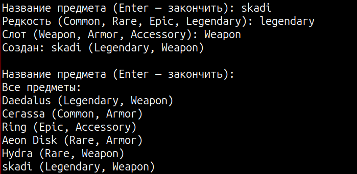

# КТ №13 — Коллекция структур и перечисления

**Вариант 2 — RPG-предмет**

- `enum ItemRarity { Common, Rare, Epic, Legendary }` и `enum ItemSlot { Weapon, Armor, Accessory }`.
- `struct Item { string Name; ItemRarity Rarity; ItemSlot Slot; }` с переопределённым `ToString()`, например `"Меч Дракона (Legendary, Weapon)"`.
- Создайте массив или список из 5 предметов (вручную).
- Прочитайте один предмет из коллекции в локальную переменную, измените у копии `Rarity`, и выведите оба значения, доказав, что коллекция не изменилась.
- Реализуйте разбор строки в `ItemRarity` через `Enum.TryParse` — продемонстрируйте на корректном (`"Epic"`) и некорректном (`"Mythic"`) значении.

## Проверочные ключи

| Действие | Ожидаемый результат |
|---|---|
| `items[0]` (до изменения копии) | `Daedalus (Legendary, Weapon)` |
| копия `items[0]`, `Rarity` копии изменена на `Common` | копия — `Daedalus (Common, Weapon)`, `items[0]` — без изменений |
| `Enum.TryParse<ItemRarity>("Epic", out var r)` | `true`, `r == ItemRarity.Epic` |
| `Enum.TryParse<ItemRarity>("Mythic", out var r)` | `false`, без исключения |

## Создание предмета пользователем

